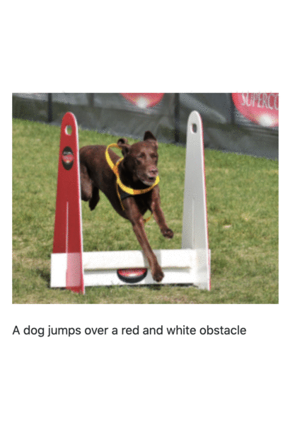
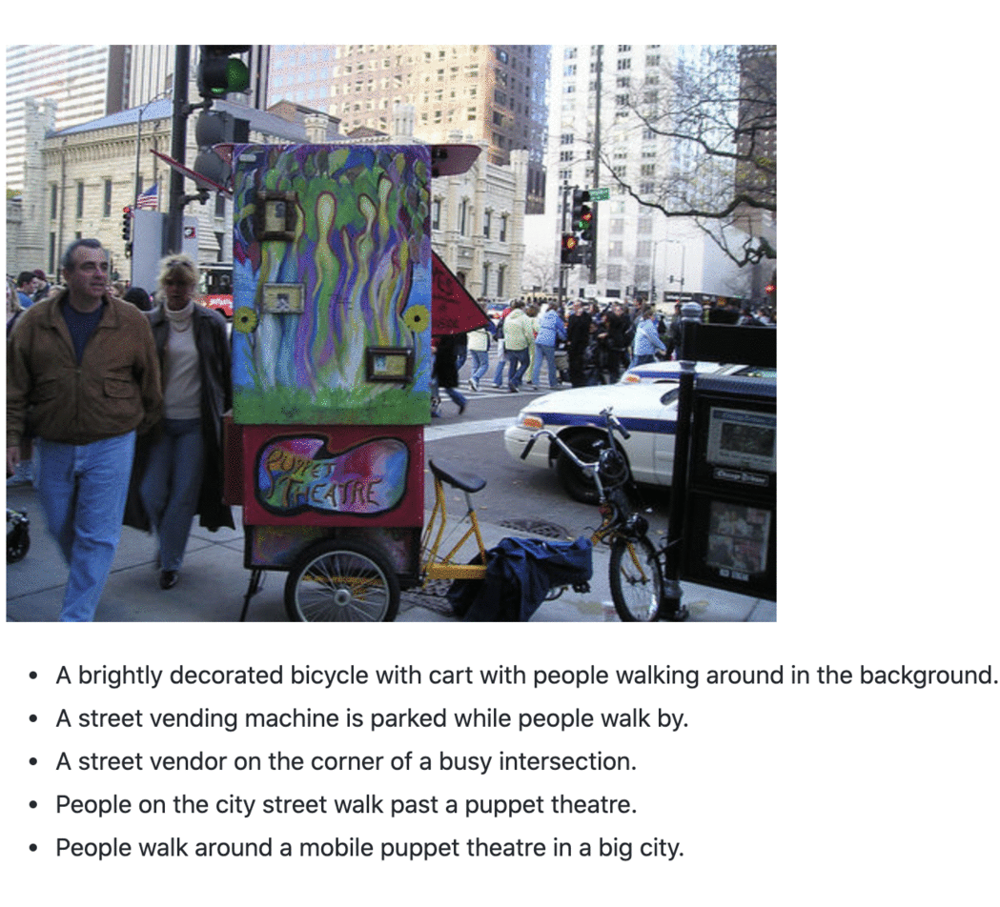
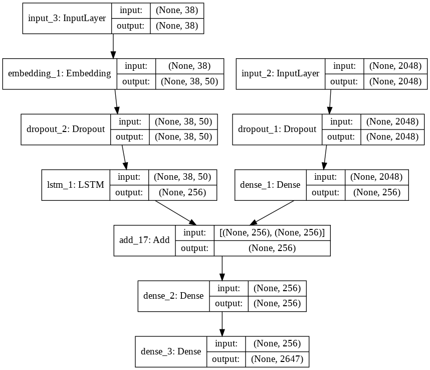
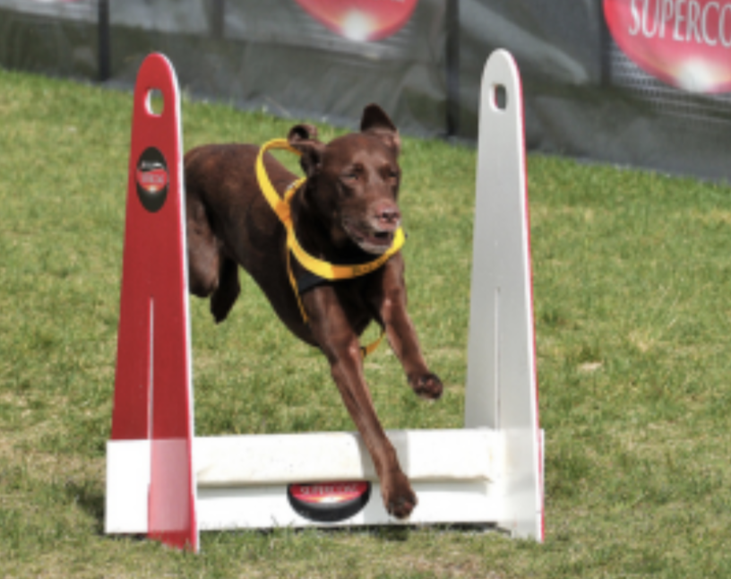
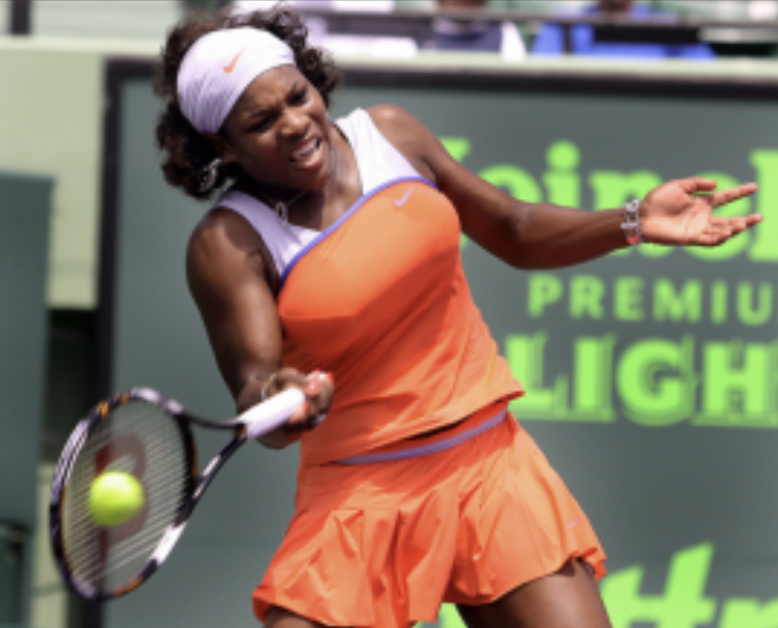
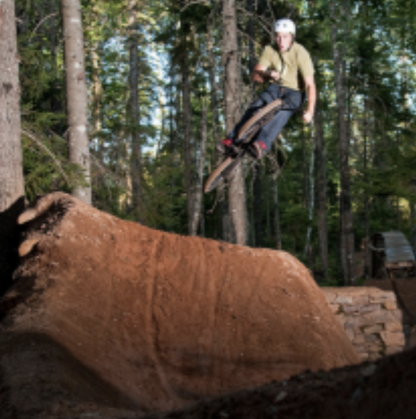
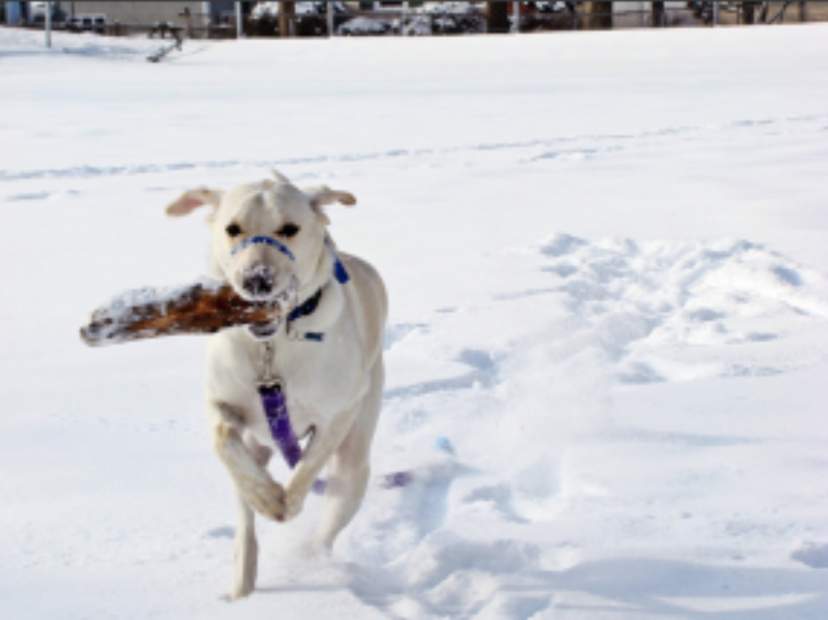
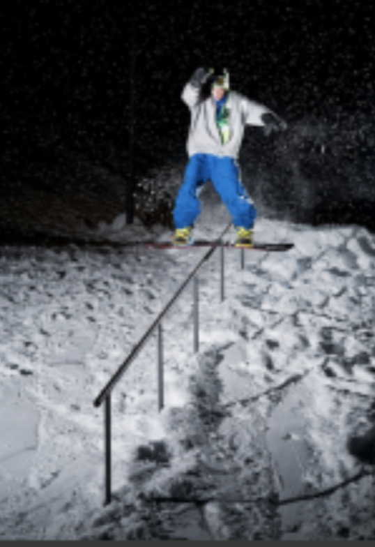
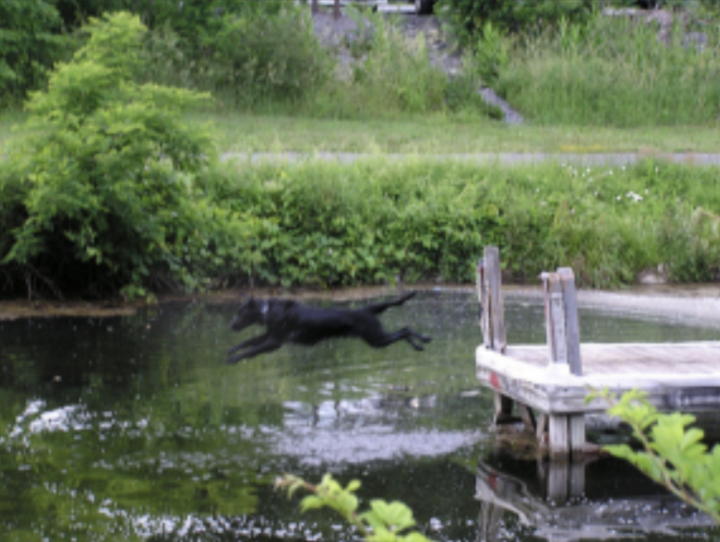

<h1> Neural Image Caption Generator </h1>

This is a Deep Learning Model for generating captions for images. It uses techniques from Computer Vision and Natural Language Processing. Some handpicked examples of images from test dataset and the captions generated by the model are shown below.

     
<h3> TABLE OF CONTENTS </h3>
<ol type="I">
    <li><a href="#intro"> Introduction </a></li>
    <li><a href="#dataset"> Dataset </a></li>
    <li><a href="#model"> Model </a> </li>
<!--     <li><a href="#examples"> Examples </a></li> -->
    <li><a href="#frameworks"> Frameworks, Libraries & Languages </a></li>
    <li><a href="#usage"> Usage </a></li>
    <li><a href="#acknowledgement"> Acknowledgement </a></li>
</ol>

<h2 id="intro"> Introduction </h2>

Deep Learning and Neural Networks have found profound applications in both NLP and Computer Vision. Before the Deep Learning era, statistical and Machine Learning techniques were commonly used for these tasks, especially in NLP. Neural Networks however have now proven to be powerful techniques, especially for more complex tasks. With the increase in size of available datasets and efficient computational tools, Deep Learning is being throughly researched on and applied in an increasing number of areas.
 
In 2012 the Google <a href="http://www.image-net.org/">ImageNet</a> Challenge (ILSVRC) results showed that Convolutional Neural Networks (CNNs) can be an excellent choice for tasks involving visual imagery. Being translation invariant, after learning a pattern in one region of an image, CNNs can very easily recognize it in another region - a task which was quite computationally inefficient in vanilla feed-forward networks. When many convolutional layers are stacked together, they can efficiently learn to recognize patterns in a hierarchical manner - the initial layers learn to detect edges, lines etc. while the later layers make  use of these to learn more complex features. In this project, we make use of a popular CNN architecture - the ResNet50 to process the input images and get the feature vectors.
 
For generating the captions, we make use of Long Short-Term Memory (LSTM) networks. LSTMs are a variant of Recurrent Neural Networks which are widely used in Natural Language Processing. Unlike a Dense layer, an RNN layer does not process an input in one go. Instead, it processes a sequence element-by-element, at each step incorporating new data with the information processed so far. This property of an RNN makes it a natural yet powerful architecture for processing sequential inputs.

<h2 id="dataset"> Dataset </h2>

This project uses the <a href="https://www.ijcai.org/Proceedings/15/Papers/593.pdf">Flickr 8K</a> dataset for training the model. This can be downloaded from <a href="https://www.kaggle.com/shadabhussain/flickr8k?select=model_weights.h5"> here</a>. It contains 8000 images, most of them featuring people and animals in a state of action. Each image is provided with five different captions describing the entities and events depicted in the image. Different captions of the same image tend to focus on different aspects of the scene, or use different linguistic constructions. This ensures that there is enough linguistic variety in the description of the images.
 
Some sample examples of images from the dataset, and their captions are given below-

<h2 id="model"> Model </h2>

    This project uses the ResNet50 architecture for obtaining the image features. ResNets (short for Residual Networks) have been classic approach for many Computer Vision tasks, after this network won the 2015 ImageNet Challenge. ResNets showed how even very Deep Neural Networks (the original ResNet was around 152 layers deep!) can be trained without worrying about the vanishing gradient problem.
The strength of a ResNet lies in the use of Skip Connections - these mitigate the vanishing gradient problem by providing a shorter alternate path for the gradient to flow through.  
ResNet50 which is used in this project is a smaller version of the original ResNet152. This architecture is so frequently used for Transfer Learning that it comes preloaded in the Keras framework, along with the weights (trained on the ImageNet dataset). Since we only need this network for getting the image feature vectors, so we remove the last layer (which in the original model was used to classify input image into one of the 1000 classes). The encoded features for training and test images are stored at "encoded_train_features.pkl" and "encoded_test_features.pkl" respectively.

	<figure>
		
		<figcaption> A plot of the architecture </figcaption>
	</figure>

<a href="https://nlp.stanford.edu/projects/glove/">GloVe</a> vectors were used for creating the word embeddings for the captions. The version used in this project contains 50-dimensional embedding vectors for 6 Billion English words. It can be downloaded from <a href="https://www.kaggle.com/watts2/glove6b50dtxt"> here</a>. These Embeddings are not processed (fine-tuned using the current data) further during training time.  
    The neural network for generating the captions has been built using the Keras Functional API. The features vectors (obtained form the ResNet50 network) are processed and combined with the caption data (which after converting into Embeddings, have been passed through an LSTM layer). This combined information is passed through a Dense layer followed by a Softmax layer (over the vocabulary words). The model was trained for 20 epochs, and at the end of each epoch, the model was saved in the "/model_checkpoints" directory. This process took about half an hour.

<!-- <h2 id="examples"> Examples </h2>

The trained model was used to generate caption for images from the test dataset. A few chosen examples from this are given below.
<figure>
    
	<figcaption> 
A dog jumps over a red and white obstacle 
</figcaption>
</figure>
<figure>
    
	<figcaption> 
 A tennis player hitting the ball 
 </figcaption>
</figure>
<figure>
    
	<figcaption> 
 A man on a bike is jumping off a rocky ledge 
 </figcaption>
</figure>
<figure>
    
	<figcaption> 
 A white dog running through the snow 
 </figcaption>
</figure>
<figure>
    
	<figcaption> 
 A skateboarder is performing a trick on a railing 
 </figcaption>
</figure>
<figure>
    
	<figcaption> 
 A dog is jumping into a pond 
 </figcaption>
</figure>

 -->

<h2 id="frameworks">Frameworks, Libraries & Languages</h2>
<ul>
    <li> Keras </li>
    <li> Tensorflow </li>
    <li> Python3 </li>
    <li> Numpy </li>
    <li> Matplotlib </li>
    <li> pickle-mixin </li>
</ul>

<h2 id="usage">Usage</h2>

On the terminal run the following commands-

    <ol>
        <li>
            Install all dependencies
             
            <code> pip install python3 </code>
             
            <code> pip install numpy </code>
             
            <code> pip install matplotlib </code>
             
            <code> pip install pickle-mixin </code>
             
            <code> pip install tensorflow </code>
             
            <code> pip install keras </code>
        </li>
        <li>
            Clone this repository on your system and head over to it
             
              <code> git clone https://github.com/matakshay/Neural_Image_Caption_Generator </code>
             
            <code size> cd Neural_Image_Caption_Generator </code>
        </li>
	<li>
            To run the model over a random image from the test dataset and see the caption, execute the following command-
             
            <code> python3 predict.py </code>
             
            This command can be executed multiple times and each time a random image and its caption (generated by the model) will be displayed
        </li>
	<li>
            To run the model and generate caption for a custom image, move the image (in JPEG format) to the current directory and rename it to "input.jpg". Then type the following on the terminal-
             
                <code> python3 generate.py </code>
             
            This loads the model and runs it with the input image. The generated caption will be printed.
        </li>
    </ol>

<h2 id="acknowledgement">Acknowledgement</h2>

    I referred many articles & research papers while working on this project. Some of them are listed below-

    <ul>
        <li> https://www.ijcai.org/Proceedings/15/Papers/593.pdf </li>
        <li>  https://arxiv.org/abs/1411.4555v2 </li>
        <li> https://en.wikipedia.org/wiki/Convolutional_neural_network </li>
        <li> Deep Learning with Python by Fraçois Chollet </li>
        <li> https://towardsdatascience.com/understanding-and-coding-a-resnet-in-keras-446d7ff84d33 </li>
        <li> https://arxiv.org/abs/1512.03385 </li>
    </ul>
